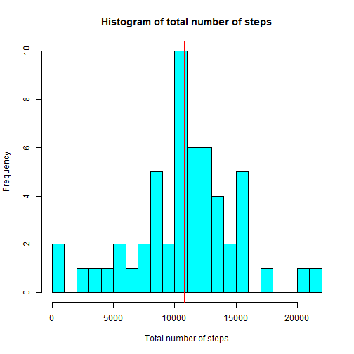
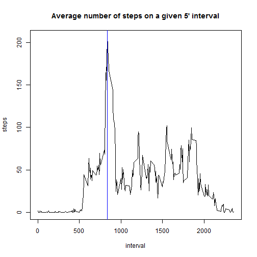

## Reproducible Research - Data Science Specialization
### By Magdiel Guardado

### Loading and presenting the data

First, we are going to load the csv as a data frame from the working directory.

Also, we are going to create two different data frames. Data frame `df` is going to have the data "as is". The other frame, `df0`, is going to substitute all the `NA` values for zeros in the steps column.


```r
df <- read.csv("activity.csv")
df0 <- df ## Alternative data frame with zeros instead of NAs
```

### What is mean total number of steps taken per day?

To answer this, we will make other data frame which will summarize the total number of steps per day. In order to show days with a total of zero steps (as a result of NAs in all intervals), we use the data that has zeros instead of NAs.


```r
##Calculate the total number of steps taken per day
## 
subset1 <- aggregate(steps ~ date, df0, sum)

#calculate mean and median
m <- mean(subset1$steps,na.rm=TRUE)
md <- median(subset1$steps,na.rm=TRUE)
```

Further, we can observe that the average number of steps is 10766.1886792453, and the median is 10765

By making and histogram, we can visualize how the total number of steps is distributed.


```r
## Make histogram
hist(subset1$steps, breaks=20, col="cyan", 
     main="Histogram of total number of steps", 
     xlab="Total number of steps")

abline(v=m, col="red")
```

 

### What is the average daily activity pattern?

First, we wish to have a mean value of a given interval, across all days, and then we are going to plot it.


```r
## Calculate the average number of steps taken in each in 5-min interval
## For accurate means, we will use the data with NAs
subset2 <- aggregate(steps ~ interval, df, mean)

## time interval that, on average across all days, 
## contains maximum number of steps
max <- subset2[which.max(subset2$steps),1]

## Time series plot of 5-min interval vs average number of steps
with(subset2, plot(interval, steps, type="l", 
                   main="Average number of steps on a given 5' interval"))
abline(v=max, col="blue")
```

 

Also, we can observe that the interval that has the maximum average of number of steps is 835.

### Imputing missing values

First, we are going to check how many rows have `NA`. 


```r
## Calculate total number of NAs
## amount of "TRUE" is total of NAs
table(is.na(df[,1]))
```

```
## 
## FALSE  TRUE 
## 15264  2304
```

Therefore, the total number of NAs is 2304.

Now, we are going to fill all the missing values by using the mean for that day and see how this impacts the values from before.


```r
## Create a copy of the original dataset
## Using the mean for that day to fill the NAs
dfnew <- df
for(i in 1:17568){
  if(is.na(dfnew[i,1])){
    dfnew[i,1] <- subset1[as.character(dfnew[i,2]),2]
  }
}
##  Creating histogram from new dataset with filled NAs
subset1new <- aggregate(steps ~ date, dfnew, sum)

hist(subset1new$steps, breaks=20, col="cyan", 
     main="Histogram of total number of steps", 
     xlab="Total number of steps")
```

 

The histograms appear to be the same. The reason for this is that there are not NAs in days that there are registered steps. That is, the days that had usage of the step counter counted steps for the whole day.

Therefore, the only days that have NAs, have it in all its intervals.
So the mean (zero), doesn't affect the histogram.

### Are there differences in activity patterns between weekdays and weekends?

To answer this question, we are going to create a new factor that will classify the interval as occurring in a weekday or a weekend.

Lastly, we will do a panel plot to ilustrate the differences.


```r
## Converting the date column to dates and adding another column
## defining if the date was a weekday or weekend
library(chron)

dfnew$date <- as.Date(dfnew$date, "%Y-%m-%d")

dfnew$weektype <- is.weekend(dfnew$date)

dfnew$weektype <- gsub("TRUE","weekend",dfnew$weektype)
dfnew$weektype <- gsub("FALSE","weekday",dfnew$weektype)

## panel plot
library(lattice)
subset2new <- aggregate(steps ~ interval+weektype, dfnew, mean)
xyplot(steps ~ interval|weektype, data=subset2new, type="l",layout=c(1,2))
```

 
